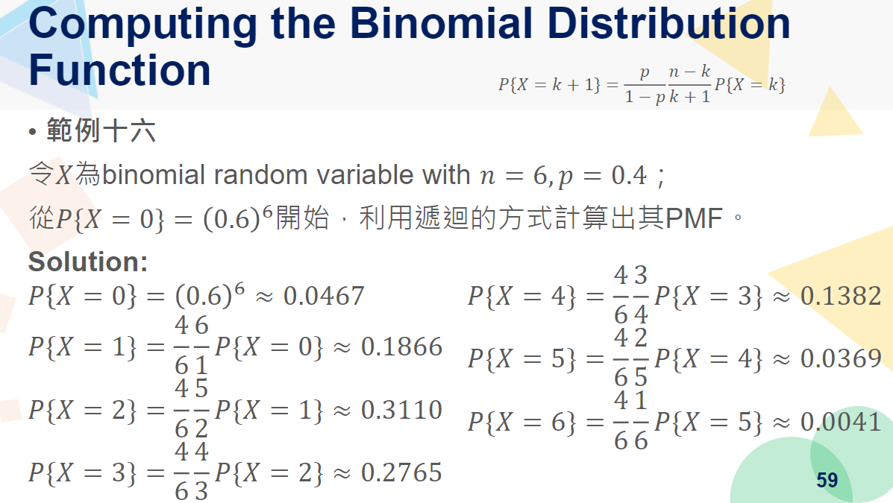
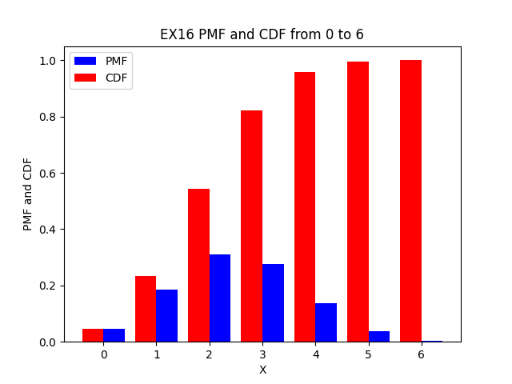
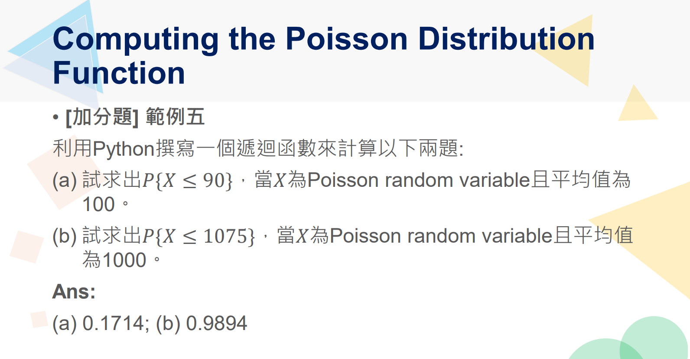

# Probability-and-Statistics
機率與統計作業加分題 of YouTube: Coding the World

## 教授
- [Coding the World - 機率與統計](https://www.youtube.com/watch?v=OPKXaWbrKZo&list=PLq9Ksh67Db7ioX8M-Hjtur_-SMB3KAaC_&pp=0gcJCV8EOCosWNin)

## Problems
### 1
Using Python programming, to proof "for any constants a and b: Var(aX+b)=a^2Var(X)"
You may try different a and b for calculating the variance in order to prove this.
### 2

Define a recursive function to compute the values of PMF and CDF of "EX16" in Random Variables. Meanwhile, you need to plot its PMF and CDF with bar chart by using Matplotlib.
If you are not familiar with Python, especially in defining a recursive function or plot a data, then you may watch my teaching videos.
1. Define a function: https://youtu.be/VSKMB-vwpd8
2. Visualization: https://youtu.be/xiSOQiqIJrY

### 3

Random Variable (II) pp.17